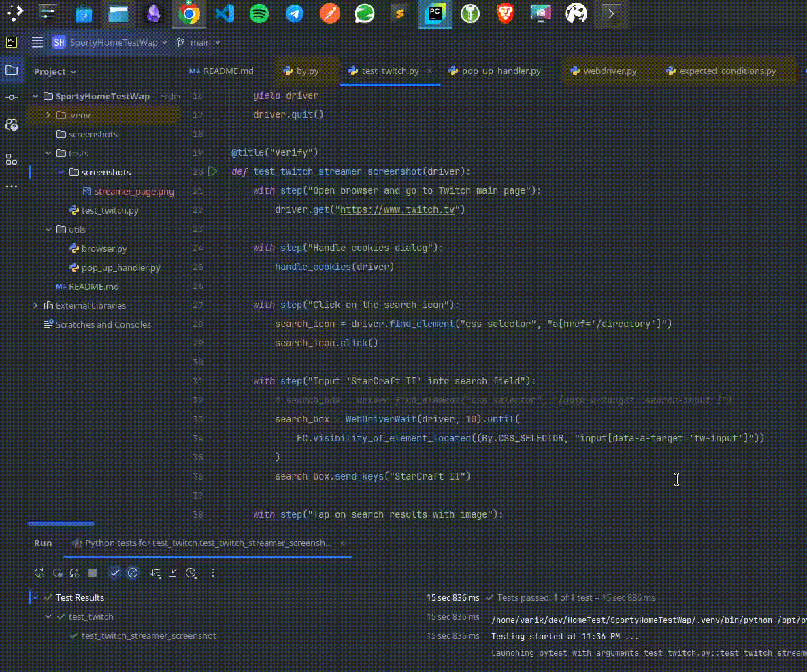

Repo contains test for twitch with following steps:

1. Open browser and go to Twitch main page
2. Handle cookies dialog
3. Click on the search icon
4. Input 'StarCraft II' into search field
5. Tap on search results with image
6. Scroll down twice
7. Click on any streamer
8. Wait until streamer's page load
9. Handle pop-up if it appears

Expected result: page of streamer displayed

Project structure:
```
SportyHomeTestWap/
│
├── tests/
│   └── test_twitch.py - test script written with allure steps. pytest as a test runner
│
├── utils/
│   ├── browser.py - browser setup
│   └── pop_up_handler.py - functions to handle cookies popup and pop up on streamer's page
│
├── screenshots/  - folder for screenshots
│
├── requirements.txt - project requirements
│
└── README.md
```
